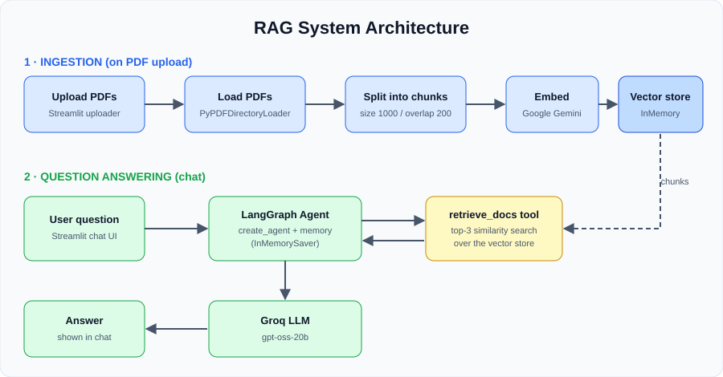

# RAG System

A Streamlit app that lets you chat with your PDF documents using Retrieval-Augmented Generation (LangChain + LangGraph agent, Google embeddings, Groq LLM).

## Architecture



## Demo


## Setup

```bash
python -m venv venv
source venv/bin/activate      # Windows: venv\Scripts\activate
pip install -r requirements.txt
cp .env.example .env          # then add your API keys
```

## Run

Put your PDFs in `apps/docs_files/`, then:

```bash
cd apps
streamlit run rag_agent.py
```

## Stack
LangChain, LangGraph, Streamlit, PyPDF, Google Generative AI embeddings, Groq.
